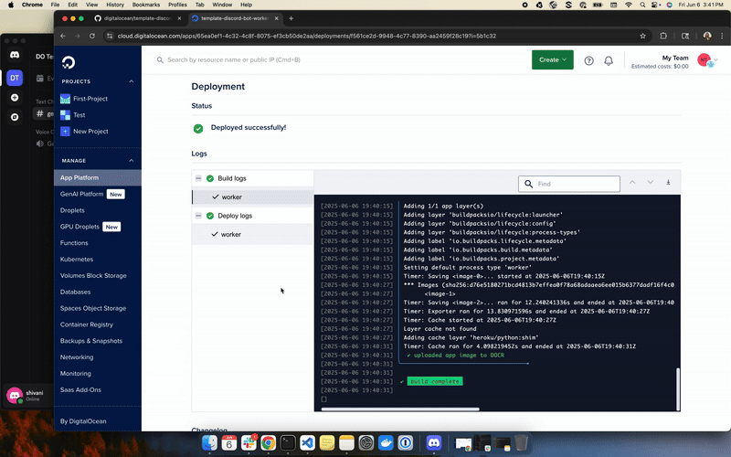

# ML JavaScript Analyzer

A machine learning-based system for analyzing JavaScript code in bulk, extracting metrics, detecting security vulnerabilities, identifying patterns, and classifying code quality using TensorFlow.

 

**Note**: Following these steps may result in charges for the use of DigitalOcean services.

### Requirements

* You need a DigitalOcean account. If you do not already have one, first [sign up](https://cloud.digitalocean.com/registrations/new).
* Python 3.8 or higher
* TensorFlow and machine learning dependencies (see requirements.txt)

## Quick Start

See [SETUP_GUIDE.md](SETUP_GUIDE.md) for detailed setup instructions.

### Fast Setup

```bash
# Install dependencies
pip install -r requirements.txt

# Configure environment
cp .env.example .env

# Run analysis
python ml_analyzer.py --directory ./data/input --analyze-all
```

## Features

- **Comprehensive Code Analysis**: Extract 50+ features from JavaScript files
- **Security Detection**: Identify vulnerabilities (eval, XSS, SQL injection, etc.)
- **Code Quality Classification**: Score code on 0-100 scale
- **ML-Powered Insights**: TensorFlow neural networks for pattern recognition
- **Flexible Processing**: Batch, stream, or hybrid processing modes
- **Multi-Project Support**: Analyze different projects with separate configurations
- **Environment Configuration**: All settings managed via .env file
- **CI/CD Integration**: GitHub Actions workflows included

## Deploying to DigitalOcean

Click this button to deploy to DigitalOcean App Platform:

[](https://cloud.digitalocean.com/apps/new?repo=https://github.com/hirepentester/Javascript/tree/deploy)

## Documentation

- **[SETUP_GUIDE.md](SETUP_GUIDE.md)** - Complete setup and configuration guide
- **[ML_README.md](ML_README.md)** - Technical documentation
- **[BRANCHING_STRATEGY.md](BRANCHING_STRATEGY.md)** - Git workflow and CI/CD pipeline
- **[examples.py](examples.py)** - Working code examples

## Learn More

To learn more about App Platform and how to manage and update your application, see [our App Platform documentation](https://www.digitalocean.com/docs/app-platform/).

## Delete the App

When you no longer need this sample application running live, you can delete it by following these steps:
1. Visit the [Apps control panel](https://cloud.digitalocean.com/apps).
2. Navigate to the ML Analyzer app.
3. In the **Settings** tab, click **Destroy**.

**Note**: If you do not delete your app, charges for using DigitalOcean services will continue to accrue.